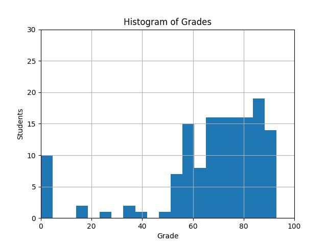

# JacobInwald (s2150204)
## Part 1: Parser
#### Test Case Statistics
|    | category                  |   hidden |   pass_public |   fail_public |   pass_hidden |   fail_hidden |
|---:|:--------------------------|---------:|--------------:|--------------:|--------------:|--------------:|
|  0 | arithmetic-comparison-ops |       15 |            15 |             0 |            13 |             2 |
|  1 | combinations              |       13 |             0 |             0 |            11 |             2 |
|  2 | complex-expressions       |       41 |            17 |             0 |            40 |             1 |
|  3 | control-flow              |        6 |             3 |             0 |             3 |             3 |
|  4 | function-prototypes       |        2 |             2 |             0 |             1 |             1 |
|  5 | literals-identifiers      |        0 |             5 |             0 |             0 |             0 |
|  6 | logical-conditional-ops   |       20 |             4 |             0 |            16 |             4 |
|  7 | simple-statements         |        7 |             8 |             0 |             7 |             0 |
|  9 | variable-defs-decls       |       10 |             7 |             0 |            10 |             0 |

Your result for part 1 is **62%** out of maximal 70%.
## Part 2: Syntax Errors
#### Test Case Statistics
|    | category      |   hidden |   pass_public |   fail_public |   pass_hidden |   fail_hidden |
|---:|:--------------|---------:|--------------:|--------------:|--------------:|--------------:|
|  8 | syntax-errors |        0 |            57 |             0 |             0 |             0 |

You received  **15%** for implementing the syntax errors.
No outstanding tests submitted.

Your result for part 2 is **15%** out of maximal 30%.
## Overall
Your overall result for this coursework is **77%** out of maximal 100%.
While we cannot share hidden test cases, we decided to share a complete parser implementation with you as part of coursework 2. Take the opportunity to inspect it to learn more about why some of your test cases may have failed. Looking at our solution may also help you to understand the space of potential design decisions.
## Class Performance
Overall, the class did very well in this coursework. Congratulations!
The average (mean) grade across the class for this coursework is 66.72%. 56.25% of all students have an excellent grade, and 76.39% have a very good or excellent grade. 88.89% of all students have a passing grade.
We share below a histogram of the grades that we awarded.

## Final Grades
All results reported are temporary until the official grades are communicated.
