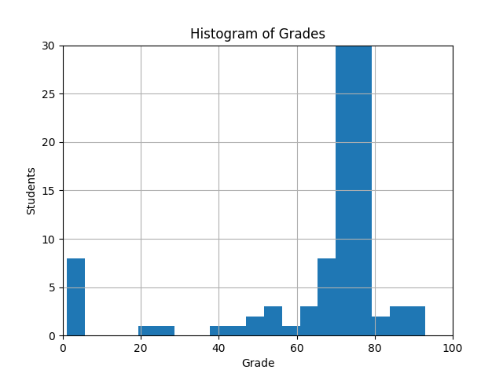

# coursework-3-JacobInwald (s2150204)
## Part 1: Code Generation
#### Test Case Statistics
|    | category                  |   hidden |   pass_public |   fail_public |   pass_hidden |   fail_hidden |
|---:|:--------------------------|---------:|--------------:|--------------:|--------------:|--------------:|
|  0 | arithmetic-comparison-ops |        0 |            23 |             0 |             0 |             0 |
|  1 | code-size-optimization    |        0 |             7 |             0 |             0 |             0 |
|  2 | complete-programs         |        0 |             2 |             0 |             0 |             0 |
|  3 | control-flow              |        9 |             5 |             0 |             8 |             1 |
|  4 | function-calls            |        5 |             2 |             0 |             5 |             0 |
|  5 | lists                     |        9 |            10 |             0 |             9 |             0 |
|  6 | strings                   |        4 |             7 |             0 |             4 |             0 |
|  7 | var-defs                  |        0 |             8 |             0 |             0 |             0 |

Your result for part 1 is **69%** out of maximal 70%.
## Part 2: Code Optimization
#### Test Case Statistics
| testname                      |   status |   base |   target |   extra points |
|:------------------------------|---------:|-------:|---------:|---------------:|
| associativity-folding.choc    |      717 |    805 |      422 |              1 |
| if-constant.choc              |       25 |     40 |       22 |              4 |
| pure-bool-function.choc       |      191 |    197 |       25 |              0 |
| pure-integer-function.choc    |      104 |    128 |       25 |              1 |
| variable-allocation-big.choc  |     2246 |   2549 |      560 |              1 |
| variable-allocation-loop.choc |      783 |    795 |      480 |              0 |

Your result for part 2 is **7%** out of maximal 30%.
## Overall
Your overall result for this coursework is **76%** out of maximal 100%.

## Class Performance
Overall, the class did very well in this coursework. Congratulations!
The average (mean) grade across the class for this coursework is 67.22%. 79.72% of all students have an excellent grade, and 87.41% have a very good or excellent grade. 92.31% of all students have a passing grade.
We share below a histogram of the grades that we awarded.

## Final Grades
All results reported are temporary until the official grades are communicated.
