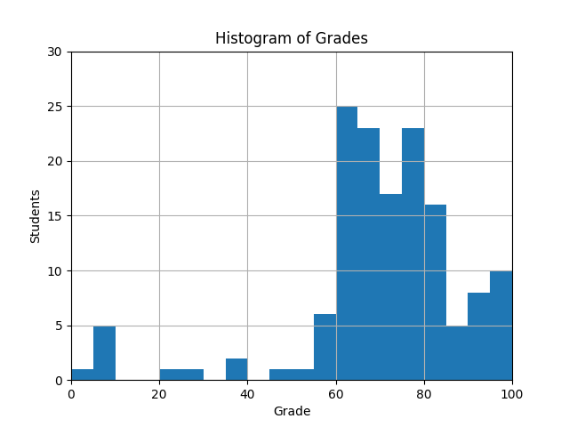

# coursework-2-JacobInwald (s2150204)
## Part 1: Type Checking
#### Test Case Statistics
|    | category                      |   hidden |   pass_public |   fail_public |   pass_hidden |   fail_hidden |
|---:|:------------------------------|---------:|--------------:|--------------:|--------------:|--------------:|
|  0 | type-checking/and-or-not-is   |       23 |             9 |             0 |            22 |             1 |
|  1 | type-checking/arithmetic      |       23 |            11 |             0 |            22 |             1 |
|  2 | type-checking/assign-and-list |        0 |            39 |             0 |             0 |             0 |
|  3 | type-checking/assign-complex  |       21 |             9 |             0 |            21 |             0 |
|  4 | type-checking/auto-generated  |      129 |             0 |             0 |           121 |             8 |
|  5 | type-checking/base-rules      |        0 |            13 |             0 |             0 |             0 |
|  6 | type-checking/comparison      |        9 |            12 |             0 |             9 |             0 |
|  7 | type-checking/control-flow    |       24 |             9 |             0 |            22 |             2 |
|  8 | type-checking/functions       |       23 |            10 |             0 |            20 |             3 |
|  9 | type-checking/index           |       18 |             4 |             0 |            18 |             0 |

Your result for part 1 is **68%** out of maximal 70%.
## Part 2: Dead Code Analysis
#### Test Case Statistics

You received  **5%** for passing **7** out of **7** dead code analysis public tests.
You received  **12%** by passing **15** hidden dead code analysis categories out of **51**.

Your result for part 2 is **17%** out of maximal 30%.

The hidden dead code categories include simple cases, like the public tests you were given, to more difficult ones, e.g., requiring to perform constant folding first to be able to detect dead code later, to really hard ones, like detecting infinite loops.
To be awarded the points of a category, it was checked that the respective error was raised if the dead code was present, but also that it was not raised if the dead code was absent, otherwise no points were given.
## Overall
Your overall result for this coursework is **85%** out of maximal 100%.
While we cannot share hidden test cases, we decided to share a complete type-checking implementation with you as part of coursework 3. Take the opportunity to inspect it to learn more about why some of your test cases may have failed. Looking at our solution may also help you to understand the space of potential design decisions.
## Class Performance
Overall, the class did very well in this coursework. Congratulations!
The average (mean) grade across the class for this coursework is 70.06%. 54.48% of all students have an excellent grade, and 87.59% have a very good or excellent grade. 93.10% of all students have a passing grade.
We share below a histogram of the grades that we awarded.

## Final Grades
All results reported are temporary until the official grades are communicated.
